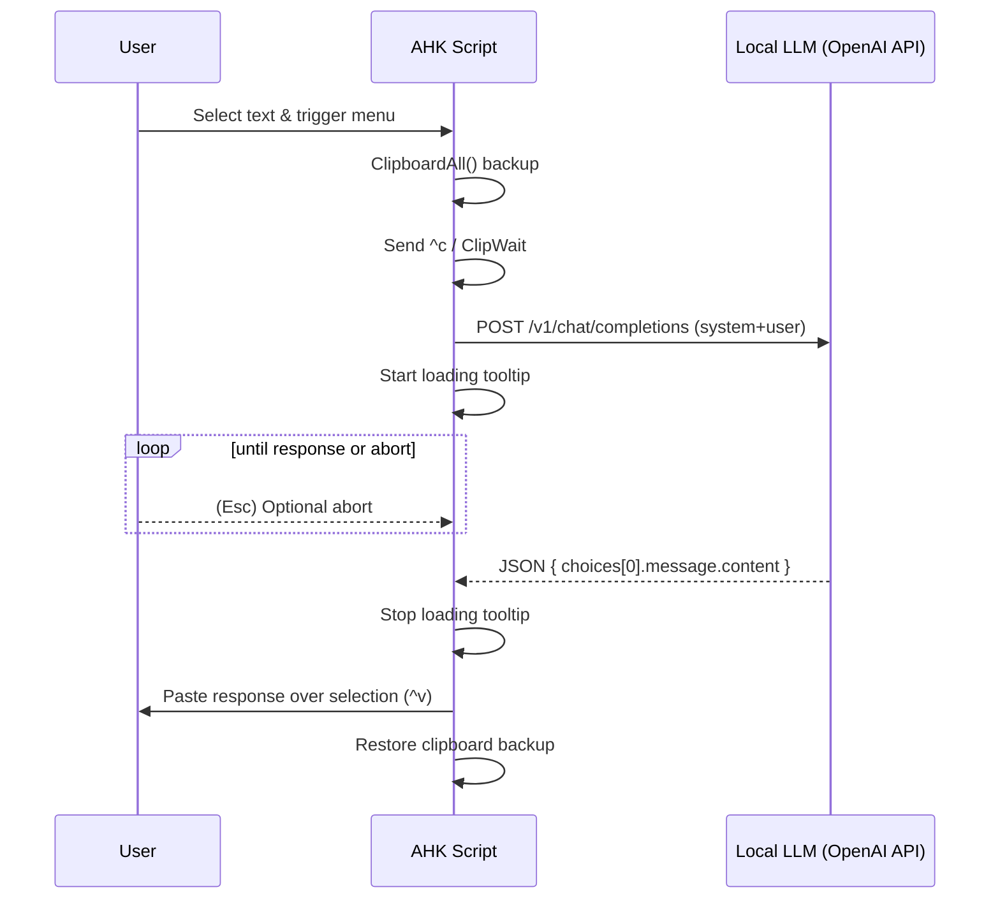

Forked from [kdalanon/ChatGPT-AutoHotkey-Utility](https://github.com/kdalanon/ChatGPT-AutoHotkey-Utility)

> [!CAUTION] 
> "no-look-ai-generated" readme:

# LLM AutoHotkey Utility

A lightweight AutoHotkey v2 utility that sends **selected text** to a local, OpenAI‑compatible LLM (e.g., **LM Studio**), executes an action (rephrase, translate, etc.), and **pastes the model’s response back** over your selection — all while **preserving your clipboard**. It supports **two models** (fast vs. best) with **per‑model generation defaults**, an **Esc to cancel** mechanism, and a **non‑blocking loading tooltip**.

---

## Table of Contents

* [Features](#features)
* [Requirements](#requirements)
* [Installation](#installation)
* [Quick Start](#quick-start)
* [Configuration](#configuration)

  * [API & Models](#api--models)
  * [Per‑Model Defaults](#per-model-defaults)
  * [Optional Global Fallbacks](#optional-global-fallbacks)
* [Hotkeys](#hotkeys)
* [Menus & Actions](#menus--actions)
* [How It Works](#how-it-works)

  * [Sequence Diagram](#sequence-diagram)
  * [Component Diagram](#component-diagram)
* [Per‑Action Overrides (Optional)](#per-action-overrides-optional)
* [Error Handling & Aborts](#error-handling--aborts)
* [Troubleshooting](#troubleshooting)
* [Advanced: Streaming](#advanced-streaming)
* [Security & Privacy](#security--privacy)
* [Suggested File Layout](#suggested-file-layout)
* [FAQ](#faq)

---

## Features

* **Zero‑mouse flow**: Select text anywhere → hotkey → choose action → response replaces selection.
* **Clipboard‑safe**: Full `ClipboardAll()` backup/restore, even on errors or aborts.
* **Two model menus**: **Fast** (smaller/quicker) and **Best** (larger/better).
* **Per‑model generation defaults**: temperature/top‑p/top‑k/min‑p/penalties differ per model.
* **Actions**: Rephrase, professional rephrase, follow instructions, reply, DE↔EN translate, To‑Dos, definitions, pros/cons + recommendation.
* **Abort**: Press **Esc** during a call to cancel cleanly.
* **Robust HTTP**: Uses `WinHTTP.WinHTTPRequest.5.1` (no cURL, no temp files).
* **OpenAI‑compatible**: Sends `{system, user}` messages to `/v1/chat/completions`.
* **Resilient parsing**: JXON first, then a minimal string fallback.
* **Animated loading tooltip**: Clean start/stop; won’t linger after paste.
* **Suspend UI**: CapsLock + ` to toggle a small suspended banner.

---

## Requirements

* **Windows 10/11**.
* **AutoHotkey v2** (make sure it’s v2, not v1).
* A local LLM server exposing **OpenAI‑compatible** `/v1/chat/completions` (e.g., **LM Studio**).

---

## Installation

1. Install **AutoHotkey v2**.
2. Save the AHK script (e.g., `LLM-Utility.ahk`).
3. Place `_jxon.ahk` in the same folder (JSON helper).
4. Start your LLM server (e.g., LM Studio) and note the **host/port**.
5. Double‑click the script to run. A tray icon appears; purple banner shows when suspended.

---

## Quick Start

1. **Select text** anywhere (editor, browser, email, etc.).
2. Press **Ctrl+Shift+L** (Fast) or **Ctrl+Shift+Ö** (Best).
3. Pick an **action** from the menu.
4. The **response replaces** your selection; your **clipboard is restored**.

> Tip: Press **Esc** if you want to **cancel** a long response.

---

## Configuration

### API & Models

```ahk
API_Key := "lm-studio"
API_URL := "http://127.0.0.1:1234/v1/chat/completions"

Model_Fast := "qwen/qwen3-30b-a3b-2507"    ; smaller/faster
Model_Best := "openai/gpt-oss-20b"         ; larger/slower
```

> Use the exact **model names** your server exposes. You can add more later.

### Per‑Model Defaults

```ahk
ModelParams := Map(
    Model_Fast, Map(
        "temperature",       0.4,
        "top_p",             0.85,
        "top_k",             30,
        "min_p",             0.05,
        "presence_penalty",  0.0
    ),
    Model_Best, Map(
        "temperature",       0.7,
        "top_p",             0.90,
        "top_k",             40,
        "min_p",             0.00,
        "presence_penalty",  1.0
    )
)
```

### Optional Global Fallbacks

```ahk
llm_temperature       := 0.7
llm_top_k             := 20
llm_min_p             := 0.00
llm_top_p             := 0.80
llm_presence_penalty  := 1.0
```

---

## Hotkeys

* **Ctrl + Shift + L** — open **Fast** model menu
* **Ctrl + Shift + Ö** — open **Best** model menu (DE layout)
* **CapsLock + `** — toggle **Suspend** (shows a violet banner)
* **Esc** — **Abort** in‑flight request

---

## Menus & Actions

**Both menus** contain identical actions; the **Fast** menu appends ` /nothink` to the system prompt.

0. Formuliere um – gleicher Stil
1. Formuliere ausführlicher, professioneller, freundlicher
2. Folge Anweisungen
3. Nachricht beantworten
4. Übersetze → Englisch
5. Übersetze → Deutsch
6. ToDos auflisten
7. Erkläre / Definition
8. Vorteile / Nachteile

> You can easily add your own actions; see [Per‑Action Overrides](#per-action-overrides-optional) for custom behaviors.

---

## How It Works

1. You **select text** and open a **model menu**.
2. Script **backs up the clipboard** (`ClipboardAll()`), then copies selection (`Ctrl+C`).
3. Builds the **messages**: `system` = chosen instruction, `user` = selected text.
4. Sends **POST** to the LLM server with the model’s **per‑model defaults**.
5. Shows an **animated tooltip** while waiting (Esc cancels).
6. On success, **response replaces** your selection via `Ctrl+V` and the **clipboard is restored**.

### Sequence Diagram



### Component Diagram

```mermaid
graph TD
    UI[Hotkeys & Menus] --> Core[ExecuteAction()]
    Core -->|Clipboard| CB[Clipboard Manager]
    Core -->|HTTP JSON| API[SendChatCompletion()]
    Core -->|UX| Tooltip[Loading Tooltip]
    API --> LLM[Local LLM Server (/v1/chat/completions)]
    Core --> Paste[Paste Result]
```

---

## Per‑Action Overrides (Optional)

Lower temperature for translations, etc.:

```ahk
ActionParamOverrides := Map(
  "to_en", Map("temperature", 0.2),
  "to_de", Map("temperature", 0.2),
  "define", Map("temperature", 0.3)
)

; In ExecuteAction(), after selecting cfg from ModelParams:
if (ActionParamOverrides.Has(actionKey)) {
    for k, v in ActionParamOverrides[actionKey]
        cfg[k] := v
}
```

---

## Error Handling & Aborts

* **Copy failed** (no selection): brief tooltip, clipboard restored.
* **HTTP timeout/connection failure**: clear tooltip message; clipboard restored.
* **Server error** (`{"error":...}`): error message shown.
* **Abort**: **Esc** cancels COM request; UI cleans up; clipboard restored.

**AHK pitfalls avoided**

* Consistent `try { } catch as e { }` blocks (no fragile one‑liners).
* Named timer for tooltip so `StopLoading()` reliably cancels it.
* Globals declared inside functions that use them (e.g., `__loadingStage`).

---

## Troubleshooting

**Tooltip never stops** → Ensure you’re on the **named timer** version (see loading block).
**Unrecognized action / Missing operator** → Usually mismatched quotes or single‑line `try`. Use block `try/catch`.
**No response / empty paste** → Verify LLM server and model names; test with a REST client.
**Abort seems slow** → Cancellation occurs when COM exposes `Abort()` and the loop checks `__abort`. If the server stalls at TCP level, Windows may delay.

---

## Advanced: Streaming

If your server supports OpenAI‑style **streaming** (`"stream": true`), you can stream tokens and insert them live at the caret. This requires:

* Sending `stream: true` in the JSON body.
* Reading an evented/streaming response and updating the target control in small chunks.

> This is an advanced enhancement; implementation details depend on your LLM server’s streaming behavior.

---

## Security & Privacy

* Everything runs **locally** against your endpoint.
* The script **does not** log or persist prompts/responses.
* Clipboard is **restored** immediately after paste.

---

## Suggested File Layout

```
LLM-Utility.ahk
_jxon.ahk
IconOn.ico
IconOff.ico
```

---

## FAQ

**Can I add a third model?**
Yes. Define `Model_Third := "..."`, add defaults in `ModelParams`, create a new menu via `AddMenuItems(NewMenu, Model_Third, isFast?)`, and bind a hotkey to `NewMenu.Show()`.

**Can I modify the prompts language?**
Absolutely. Edit the strings inside `ActionPrompts`.

**Does this work with remote APIs?**
Yes, as long as they are **OpenAI‑compatible** and reachable; update `API_URL` and auth accordingly.

---

